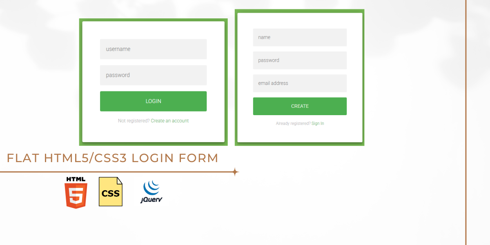

# 🔐 Flat HTML5/CSS3 Login Form




---

## 🖌️ Overview

This is a **simple and modern HTML5/CSS3 login form**.  
It can also be used as a **registration form** with minor modifications.  

The form is fully responsive and customizable, making it suitable for integration into any website or web application.  

---

## 🚀 Technologies Used

- **HTML5** → Structure  
- **CSS3 (Custom)** → Styling the login form  
- **jQuery** → Optional interactivity (if needed)  
- **Custom JS** → For validation or extra features  

## ⬇️ How to Download and Use

Anyone can download and use this project directly from GitHub by following these steps:

### 1. Download as ZIP
- Go to the repository page on GitHub.  
- Click the green **Code** button → **Download ZIP**.  
- Extract the ZIP file to your preferred location on your computer.

### 2. Clone via Git (Optional)
If you have Git installed, open your terminal/command prompt and run:  
```bash
git clone 


```
### 3. Open in Browser

Navigate to the folder where the project is downloaded.

Open index.html in your preferred web browser.

### 4. Customize

Update images in assets/img/.

Modify style.css for colors, fonts, or layout.

Add extra functionality via script.js if needed.


---

## 📂 Folder Structure

```plaintext
Flat-Login-Form/
               ├── index.html                # Main HTML file
               │
               │
               ├── assets/
               │   ├── css/
               │   │     └── style.css       # Custom CSS
               │   │
               │   ├── js/
               │   │     └── script.js       # Custom JS (if needed)
               │   │
               │   ├──     img/                      # Images (if any)
               │   │
               │   └── vendor/
               │              └── jquery.min.js   # jQuery Library (Optional)
               │
               


## Contact

📞 Contact

**For any questions regarding this project, please reach out at:**

Name: Shirajam Munir

Email: 

GitHub: 

Website/Portfolio: 

**For any questions regarding this project, please**